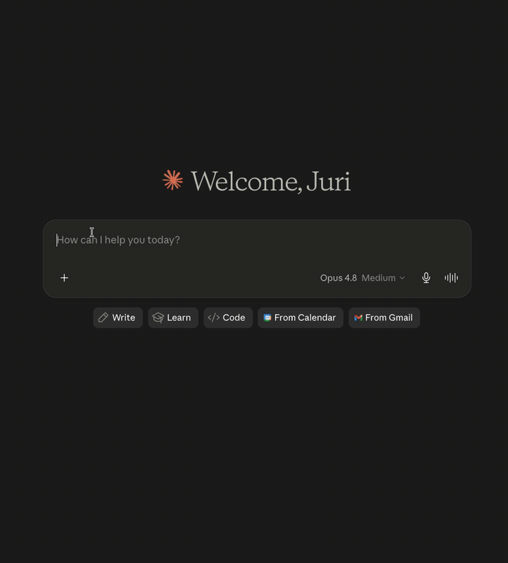
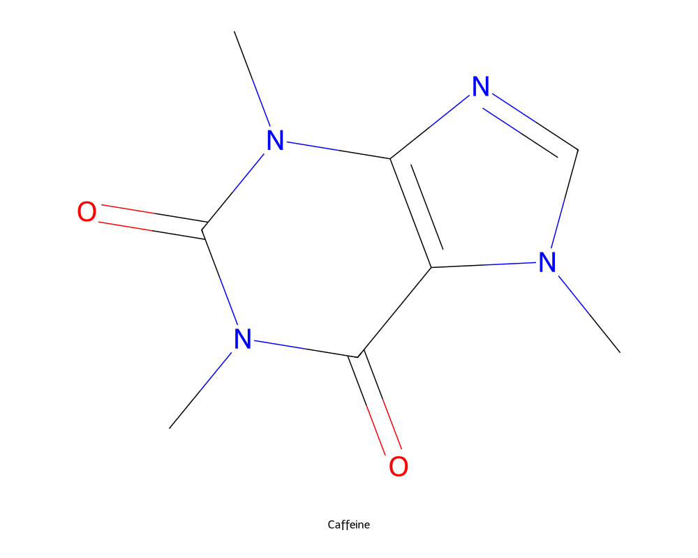
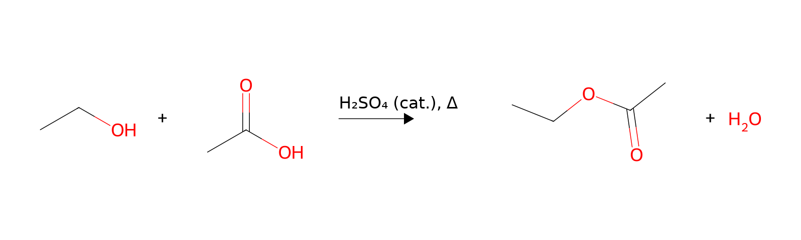
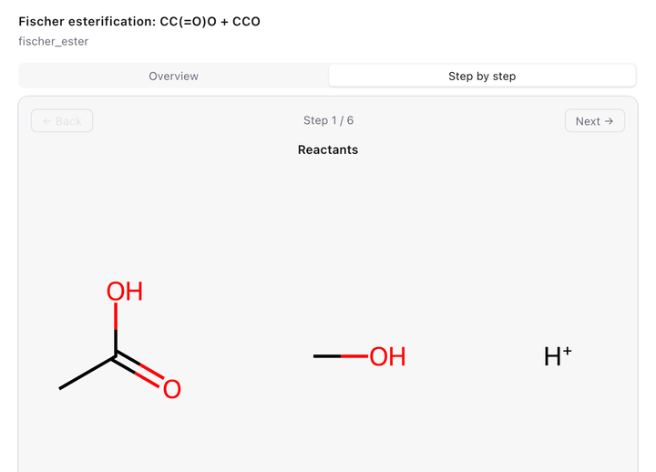
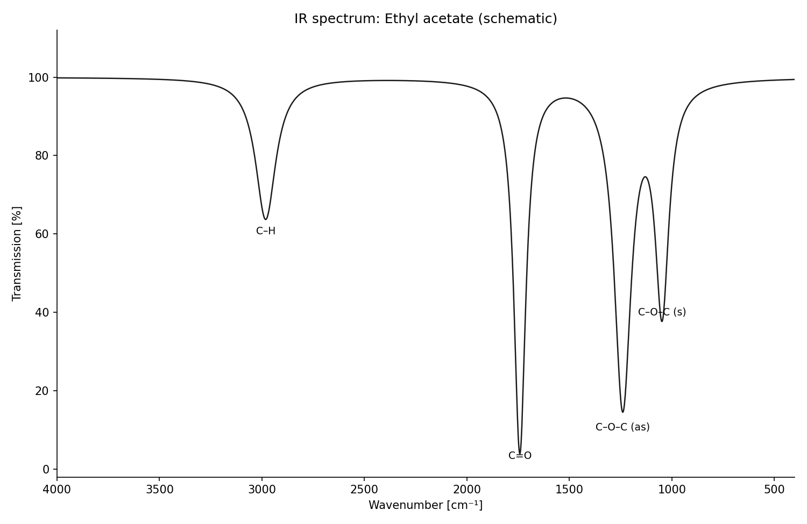

# chemdraw-mcp

[](https://github.com/jurimaxam-dotcom/chemdraw-mcp/actions/workflows/ci.yml)

**Chat → chemical structure.** An MCP server for Claude Desktop that turns
molecule names or SMILES into publication-style 2D structure drawings —
*"draw aspirin"* produces a print-ready PNG/SVG, rendered fully offline with
RDKit. No ChemDraw required; ChemDraw CDXML is available as an optional extra
format for users who want to keep editing there.

Built for pharmacy/chemistry students who spend too much time clicking
hexagons: structures, full reaction schemes, step-by-step mechanisms,
substance data sheets and Ph.Eur. assay calculations — straight from the chat,
with an interactive preview panel rendered inline.

<p align="center"></p>

## Example output

*"Draw caffeine"* — print-ready PNG, generated by `generate_molecule`:

<p align="center"></p>

*"Show the Fischer esterification of ethanol with acetic acid"* — `generate_reaction`:

<p align="center"></p>

*"Show the Fischer esterification mechanism step by step"* —
`generate_mechanism` renders curved electron-flow arrows in the interactive
panel:

<p align="center"></p>

*"Sketch the IR spectrum of ethyl acetate"* — `generate_spectrum` (draws the
peaks it is given, with per-type axis conventions):

<p align="center"></p>

## Features

- **`generate_molecule`** — name/SMILES → 2D structure as PNG + SVG
  (optionally CDXML), with properties, functional-group detection and a
  Lipinski rule-of-five check
- **`generate_reaction`** — educts + products + conditions → reaction scheme
- **`batch_generate`** — a whole list of structures in one call
- **`generate_mechanism`** — curved-arrow mechanisms (SN1, SN2, Fischer
  esterification) step by step
- **`generate_spectrum`** — schematic spectra from peak lists (IR, NIR,
  Raman, UV/Vis, fluorescence, ORD, CD, ¹H/¹³C NMR, MS) with per-type axis
  conventions — draws given peaks, does not predict spectra
- **`lookup_*`** — substance data from PubChem, ChEBI, KEGG and UniProt
  (properties, GHS safety, pathways)
- **`calculate_validation`** — Ph.Eur.-style content determination with full
  calculation steps, t-test/F-test statistics
- **Interactive in-chat UI** (MCP App): hover atoms, inspect functional
  groups, export PNG with one click
- **macOS ChemDraw bridge** (optional): open any generated structure directly
  in ChemDraw via `open_chemdraw_file`

## Installation

```bash
git clone https://github.com/jurimaxam-dotcom/chemdraw-mcp.git
cd chemdraw-mcp && ./install.sh
```

The installer sets up everything: installs [uv](https://docs.astral.sh/uv/)
if missing, resolves Python + RDKit, and registers the server in Claude
Desktop's config (idempotent, with backup — existing MCP servers are left
untouched). Restart Claude Desktop, then ask: *"draw caffeine"*.

Optional: with a Java runtime installed (e.g. `brew install openjdk`),
systematic IUPAC names — including ones no database indexes — are parsed
offline via [OPSIN](https://github.com/dan2097/opsin). Without Java the
server falls back to the PubChem/NCI online lookup.

## How it works

```
name / SMILES
   │
   ▼
resolver ──► OPSIN (systematic IUPAC names, offline) ──► PubChem / NCI (names)  ·  direct parse (SMILES)
   │
   ▼
RDKit 2D coordinates ──► validation (sanity, round-trip)
   │
   ├──► image_export   → PNG + SVG files          (primary, offline)
   ├──► svg_renderer   → interactive chat preview (MCP App resource)
   └──► cdxml_writer   → ChemDraw CDXML           (optional, on request)
```

## Development

```bash
uv sync                      # backend deps
cd chemdraw_tool/ui && npm install && npx playwright install chromium  # frontend, once
./test.sh                    # the gate: pytest + JS unit + headless-Chromium e2e
```

~290 tests, written test-first. The e2e test rasters a real RDKit SVG in
headless Chromium and compares it against an exact pixel snapshot.

## License

Apache-2.0 — see [LICENSE](LICENSE). Copyright 2026 jurimaxam-dotcom.

> **Disclaimer:** This is an unofficial, independent project, not affiliated
> with or endorsed by Revvity. *ChemDraw* is a trademark of Revvity Signals
> Software, Inc. This tool does not include or require ChemDraw; it can
> optionally export files in the open CDXML format.
